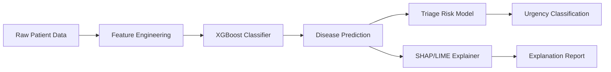

### AI-Powered Medical Diagnosis with Explainable Intelligence

---

## Overview

*SymptomClassifier-XAI is an advanced machine learning system that predicts diseases from patient symptoms while providing transparent, explainable AI insights. The project combines state-of-the-art classification algorithms with interpretability frameworks to deliver trustworthy medical predictions with clear reasoning.*

--- 

## Technical Architecture

### Data Flow

---

### Model Pipeline

1. **Input Processing**: Multi-hot encoding of symptoms + demographic features
2. **Classification**: XGBoost multi-class prediction
3. **Interpretation**: SHAP values for feature importance
4. **Risk Assessment**: Rule-based triage mapping
5. **Output**: Disease prediction + risk level + explanation

---

### ⭐ Star this repository if you find it helpful!

**Made with ❤️ for transparent healthcare AI**

